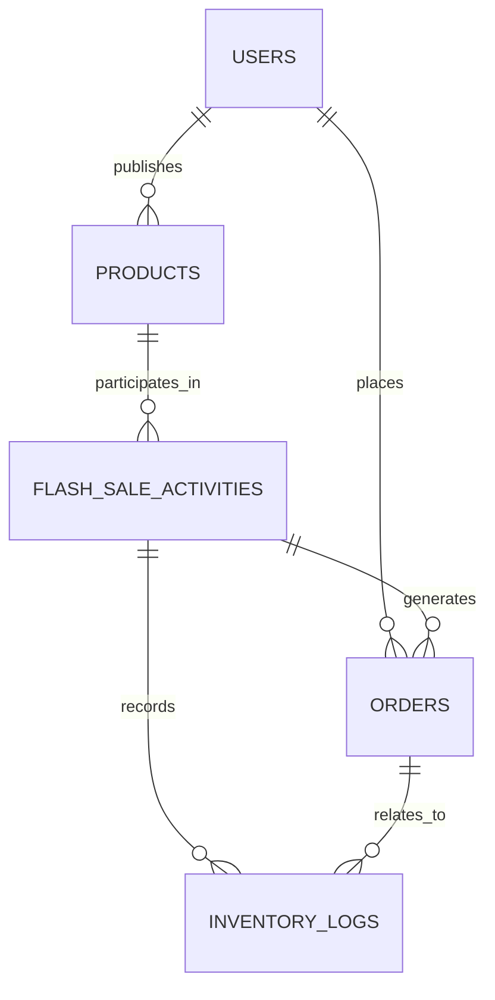

# 数据库设计

## 1. 环境与初始化

数据库设计目标为 MySQL 5.7，存储引擎统一使用 InnoDB，字符集使用 `utf8mb4`，排序规则使用 `utf8mb4_unicode_ci`。

MySQL 5.7 会解析但不会执行 `CHECK` 约束，因此本项目使用以下组合保证数据有效性：

- `UNSIGNED` 限制金额与库存不能为负数。
- 唯一索引保证业务编号唯一并防止重复下单。
- 外键保证引用关系有效。
- `BEFORE INSERT/UPDATE` 触发器校验跨字段规则。
- 抢购事务的条件更新保证库存不会超卖。

数据库中存在两类用户：

- MySQL 账号 `campus_app@127.0.0.1`：供 C++ 服务连接数据库。
- `users` 表中的业务用户：校园学生和管理员。

首次初始化：

```bash
# 先修改 01_create_database.sql 中的示例密码
mysql -u root -p < sql/01_create_database.sql
mysql -u root -p < sql/02_schema.sql
mysql -u root -p < sql/03_seed.sql
```

验证核心查询：

```bash
mysql -u root -p < sql/04_queries.sql
```

应用配置中的 `mysql_user` 应为 `campus_app`，密码必须与初始化脚本中设置的本地密码一致。真实密码只写入被 Git 忽略的 `config/config.json`。

## 2. 实体关系



关系模式：

```text
users(
  id PK,
  username UK,
  password_hash,
  role,
  status,
  created_at,
  updated_at
)

products(
  id PK,
  product_no UK,
  seller_id FK -> users.id,
  title,
  description,
  original_price_cents,
  status,
  created_at,
  updated_at
)

flash_sale_activities(
  id PK,
  activity_no UK,
  product_id FK -> products.id,
  flash_price_cents,
  total_stock,
  available_stock,
  start_time,
  end_time,
  status,
  created_at,
  updated_at
)

orders(
  id PK,
  order_no UK,
  user_id FK -> users.id,
  activity_id FK -> flash_sale_activities.id,
  product_id FK -> products.id,
  product_title_snapshot,
  purchase_price_cents,
  quantity,
  total_amount_cents,
  status,
  created_at,
  updated_at,
  UK(activity_id, user_id)
)

inventory_logs(
  id PK,
  activity_id FK -> flash_sale_activities.id,
  order_id FK -> orders.id nullable,
  change_amount,
  stock_after,
  reason,
  created_at,
  UK(order_id, reason)
)
```

## 3. 表职责

### users

保存登录信息、用户角色和账号状态。用户名唯一，第一版支持普通用户 `USER` 和管理员 `ADMIN`。

### products

保存卖家发布的闲置商品。金额统一使用整数分，避免浮点精度问题。商品和抢购活动分表，使同一商品后续可以创建多场活动。

### flash_sale_activities

保存抢购价格、活动时间和库存。`total_stock` 是初始库存，`available_stock` 是当前可用库存。

### orders

第一版规定每次抢购只能购买一件，因此暂不设计订单明细表。订单保存商品名称和成交价快照，避免商品信息修改后影响历史订单展示。

`UNIQUE(activity_id, user_id)` 是防止同一用户重复下单的数据库最终约束。

### inventory_logs

记录每次库存变化。扣减使用负数，恢复使用正数。`stock_after` 用于审计每次操作后的库存结果。

## 4. 关键约束

- 用户名、商品编号、活动编号和订单编号均唯一。
- 同一用户在同一活动中最多创建一个订单。
- 活动库存满足 `0 <= available_stock <= total_stock`，由无符号类型和触发器共同保证。
- 活动开始时间必须早于结束时间。
- 第一版订单数量固定为 1。
- 订单总金额必须等于成交单价乘数量。
- 外键使用 `RESTRICT`，防止误删被订单或流水引用的数据。

应用层校验用于提供友好错误信息，数据库唯一索引、外键和触发器负责保证最终数据正确性。

## 5. 索引设计

| 索引 | 用途 |
| --- | --- |
| `uk_users_username` | 注册查重、登录查询 |
| `idx_products_seller_created` | 查询卖家发布记录 |
| `idx_products_status_created` | 商品列表筛选 |
| `idx_flash_sale_activities_status_time` | 查询当前有效活动 |
| `uk_orders_activity_user` | 防止重复下单 |
| `idx_orders_user_created` | 查询用户订单列表 |
| `idx_orders_activity_status` | 管理端统计活动订单 |
| `idx_inventory_logs_activity_created` | 查询活动库存流水 |

索引应服务于实际查询，后续通过 `EXPLAIN` 和压测结果决定是否调整。

## 6. 抢购事务

第一版采用条件更新扣减库存：

```sql
START TRANSACTION;

UPDATE flash_sale_activities
SET available_stock = available_stock - 1
WHERE id = ?
  AND status = 'ACTIVE'
  AND start_time <= NOW(3)
  AND end_time > NOW(3)
  AND available_stock > 0;

-- affected_rows 必须为 1
INSERT INTO orders (...);
INSERT INTO inventory_logs (...);

COMMIT;
```

一致性保证：

1. `available_stock > 0` 和行级更新锁保证库存不会减为负数。
2. `UNIQUE(activity_id, user_id)` 防止同一用户重复下单。
3. 库存、订单和库存流水位于同一事务，任一步失败全部回滚。
4. C++ 使用 RAII 事务对象，未显式提交时自动回滚。
5. 遇到死锁错误时，Service 层只对整个事务进行有限次数重试。

完整可执行示例见 `sql/05_flash_sale_transaction.sql`。

## 7. 测试数据

`sql/03_seed.sql` 提供：

- 1 个管理员：`admin / admin123`
- 10 个学生：`student01` 至 `student10`，密码均为 `123456`
- 4 个商品
- 进行中、未开始和已结束的活动
- 1 条历史订单及对应库存流水

密码通过 MySQL `SHA2(..., 256)` 生成，仅用于课程演示，不代表生产级密码存储方案。
